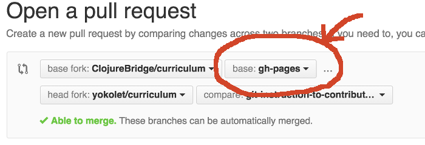

# How to contribute

Updates to the ClojureBridge curriculum are welcome and encouraged. We would not have anything without the input from the volunteers who put on workshops.

Also feel free to make forks of the curriculum and not contribute back. Make different curricula, too. These contribution guidelines are simply meant to provide guidance for the management of the main ClojureBridge curriculum.


## Getting Started
* Make sure you have a [GitHub account](https://github.com/signup/free)
* Fork the repository on GitHub

## Keeping Forked Repository Up-to-date
* Setup your forked repository to keep up-to-date with the original
  (upstream) repository.

```bash
# Only once, at the very beginning, add upstream
git remote add upstream https://github.com/ClojureBridge/curriculum.git
git remote -v                      # origin and upstream should show up

# Fetch upstream every time before making changes
git fetch upstream                 # fetches branches and commits from upstream
git fetch rebase upstream/master
git merge upstream/master          # if you've done some work on master
git checkout --track upstream/gh-pages  # your gh-pages branch tracks upstream
git pull --rebase                  # pull and merge commits
```

## Making Changes
* If you are about to make changes on curriculum markdown files,
  read [EDITING-CURRICULUM.md](EDITING-CURRICULUM.md) as well.

```bash
git checkout gh-pages              # your topic branch base should be gh-pages
git checkout -b your-topic-branch

# make some changes

git add -p                         # add your changes
git commit -m"commit message"      # commit changes with a message
git push origin your-topic-branch  # origin is your forked repository
```

* (Probably need some stuff in here about keeping slides in sync with narrative, etc)
* (Add more git guidance?)

## Submitting Changes
* Push your committed changes to your local fork of the repository

```bash
git push origin your-topic-branch  # origin is your forked repository
```

* Create a pull request



* Submit a pull request (PR) to the ClojureBridge/curriculum repository
* The ClojureBridge curriculum team will review and discuss the pull
  request in comments on the PR.
* Two curriculum team members must give a thumbs up, then the PR will be accepted.


# Curriculum Team
* Wait, why does the curriculum team get to say which PRs get accepted?? I'm glad you asked! If you contribute more than two patches, you, too, will become part of the curriculum team. 
* Curriculum team members are given commit rights to the curriculum.
* Commit rights are meant for approving PRs, not for making direct commits.
* There is also a [ClojureBridge curriculum group](https://groups.google.com/forum/#!forum/clojurebridge-curriculum) for discussing curriculum direction. 


# Workshop/Chapter curriculum forks
* Workshops or chapters that are using the main ClojureBridge curriculum should fork the curriculum in their chapter's github (a la [https://github.com/clojurebridge-sf/curriculum](https://github.com/clojurebridge-sf/curriculum))
* Give teachers commit rights to the chapter's fork of the curriculum
* The submit pull requests to the main curriculum, if you would like to contribute the changes back.
